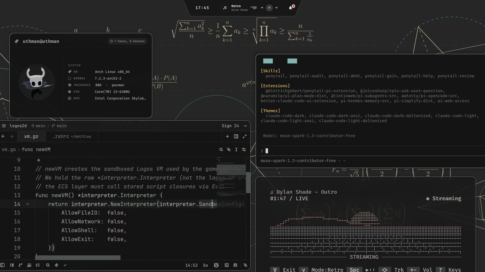
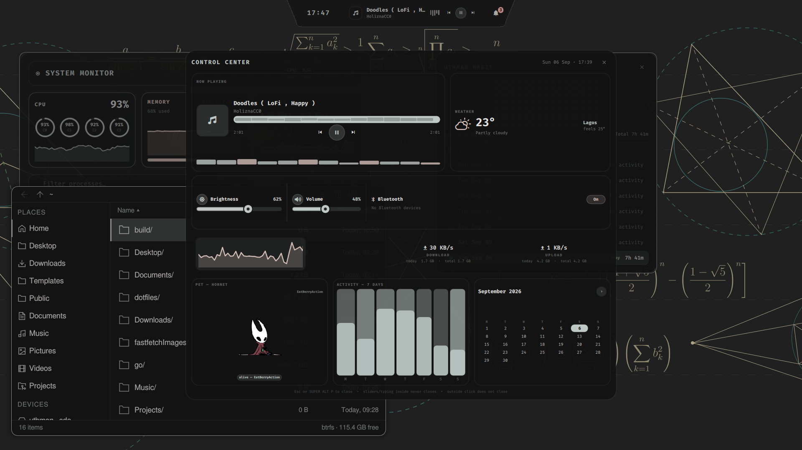
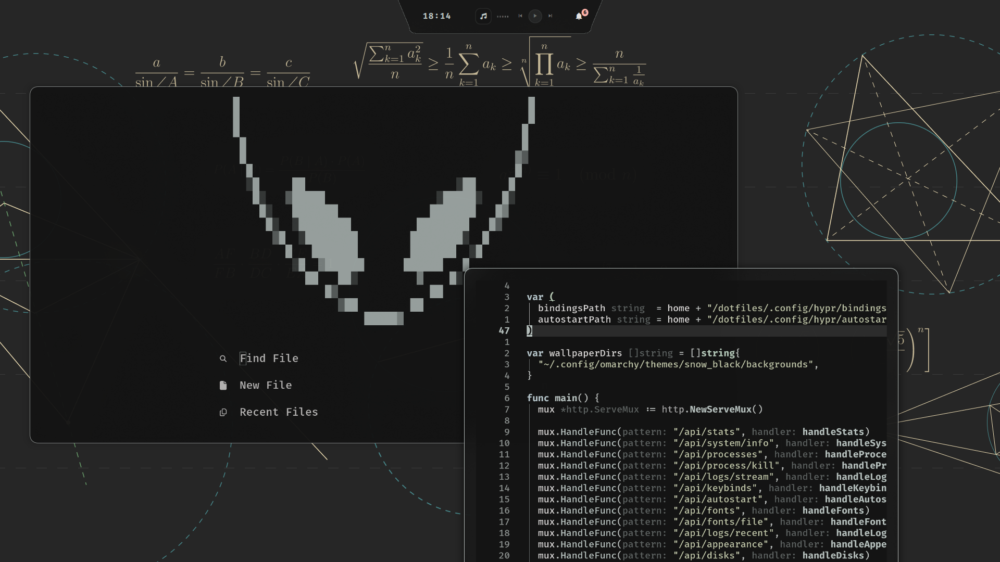

# dotfiles

Arch Linux, Hyprland, Quickshell, Matugen. One rice where the wallpaper sets the palette and everything else follows.





## What this is

A complete, daily-driven Arch Linux desktop. Hyprland composes, a Quickshell shell written from scratch draws the bar and all panels, Matugen recolors everything from the wallpaper, and a local Go control panel exposes the whole system in a browser. Companion daemons (screen time tracker, phone bridge, QEMU launcher) live in their own repos and plug into the shell. Everything here is stow-managed, so a fresh machine reproduces with two commands.

## Why it exists

Stock Wayland parts (Waybar, SwayNC, rofi menus, static SDDM themes) each solve one slice and never agree on theme, behavior, or keybinds. This repo replaces that patchwork with one QML codebase and one palette pipeline. A new feature means one new module file, not a new daemon plus a new config format plus a new theming hack. It is opinionated on purpose: one compositor, one shell language, one theme source.

## Why not use the alternatives

Omarchy (which this setup borrows vendor defaults from) is excellent if you want a maintained, batteries-included Hyprland layer. These dotfiles are the opposite trade: full ownership of every pixel and keybind, at the cost of maintaining it yourself. If you want Waybar, take Waybar. It has a larger community and more widgets. The shell here exists because Waybar cannot do a trapezoid island with album-art UI, hover transport controls, or panels that share one live palette object. If you want a prebuilt rice, this is not that. It is a working system with sharp edges, documented below.

## Features

* Glassmorphic top bar with a trapezoid island (clock, NowPlaying with hover transport, notification bell) flanked by system pills. `SUPER ALT SPACE` flips it into a floating capsule
* 50 Quickshell modules: wifi manager with speedtest, system monitor, package manager, PDF library, wallpaper storefront, ADB phone bridge, power menu, clipboard manager, control center, QEMU-adjacent helpers, and more
* Own notification stack: the shell owns `org.freedesktop.Notifications`, with toasts, action buttons, screenshot saving, a history drawer, DND, and per-app Phosphor icons
* Screen time tracker (separate Go daemon): samples the focused window, keeps a heatmap, top apps, and week bars. The control center reads the same daemon, so both views always agree
* Wallpaper-driven theming: one `matugen image` call recolors the bar, apps, login screen, editor, and terminal with no restarts
* Go control panel (`localhost:8765`) for theme, fonts, keybinds, monitors, audio, power, processes, snapshots, and updates, all from a browser
* WatchCat hotspot watchdog (per-process metering against a daily cap, notify-only)
* Snapper timeline snapshots with a documented bare-metal rollback path
* Phosphor icons plus Nerd Font glyphs, verified against the installed font files
* Every panel closes with `Esc`, every list moves with `hjkl` or arrows

## Quick start

You need Arch Linux, `yay`, and a GPU with working Wayland drivers.

Install the dependencies. The installer warns about anything missing but does not abort, so you can install in rounds and re-run it.

```bash
yay -S hyprland quickshell kitty matugen starship zsh lsd zoxide fzf \
       cava btop walker rofi swaync mako swayosd hyprlock hypridle hyprsunset sddm \
       xdg-desktop-portal-hyprland uwsm cliphist wl-clipboard \
       ttf-jetbrainsmono-nerd ttf-firacode-nerd inter-font
```

Clone and install. `install.sh` symlinks every config into place with stow, so `~/dotfiles` stays the single source of truth and every edit is git-tracked.

```bash
git clone https://github.com/codetesla51/uthman_dotfiles.git ~/dotfiles
cd ~/dotfiles
chmod +x install.sh
./install.sh
```

Set a wallpaper. This one command swaps the image and regenerates the entire palette live across bar, apps, and login screen.

```bash
set-wallpaper ~/Pictures/your-wallpaper.jpg   # ~/.local/bin/set-wallpaper
getTheme                                      # ~/.local/bin/getTheme, prints current palette
```

Log out, pick Hyprland at the SDDM greeter, log in. `SUPER+K` opens the searchable keybind cheatsheet if you get lost.

> [!WARNING]
> Reboot once after the first install. The SDDM theme installs to `/usr/share/sddm/themes/` (needs root) and several user services only start on a fresh login.

## How theming works

Matugen reads the wallpaper, builds a Material You palette, and fills variables in each template. One command recolors everything with no restarts:

```bash
matugen image ~/Pictures/your-wallpaper.jpg
```

`~/.config/matugen/config.toml` maps each template to its outputs. The main ones:

| Template | Output |
|----------|--------|
| `waybar` | `~/.config/quickshell/colors.css` (the file the live shell polls) |
| `hyprland-*` | `snow_black/colors.conf` + `theme/current` |
| `hyprlock-*`, `kitty-*`, `gtk`, `btop`, `walker`, `mako` | matching live files under `theme/current` |
| `cava` | `snow_black/cava_theme` + `~/.config/cava/config` (rewritten directly) |
| `sddm` | `/usr/share/sddm/themes/elarun-custom/Palette.qml` (login follows every theme change) |
| `firefox` | `theme/current/firefox{,-usercontent}.css`, symlinked as `userChrome.css`/`userContent.css` |
| `rofi`, `neovim`, `swayosd`, `zed`, `obsidian`, `swaync`, `zathura` | per-app live outputs |

Active colors live in `~/.config/theme/current/` and are rewritten on every run. `snow_black/` keeps saved snapshots, `theme-fallback/` ships the static seed.

> [!TIP]
> `Colors.qml` polls `~/.config/quickshell/colors.css` every second. Matugen replaces the file (new inode) instead of editing it, so the poller re-reads rather than watching. Palette swaps propagate with no restart.

> [!WARNING]
> Always run full `matugen image` with the same wallpaper source when you mean "refresh". Running it against a different image silently re-palettes all outputs at once. After any regen, `git diff --stat` in `~/dotfiles` should show only what you expect.

## Quickshell desktop shell

The shell replaces Waybar and SwayNC with one QML codebase. Entry is `shell.qml`, which instantiates the bar plus standalone windows sharing one `Colors` palette object. The bar window sits at `y=0 h=54`. The center tab is a trapezoid in classic mode, and `SUPER ALT SPACE` flips it into a floating black capsule. Clock, NowPlaying (album art, title/artist, live visualizer, hover transport), and the bell live flat inside it. System pills (CPU, memory, temp, network, battery, WatchCat) ride left and right as glass pills.

Hyprland binds and scripts talk to the shell over IPC, always with the identical path string:

```bash
quickshell -p ~/.config/quickshell                 # run. Never -p . or a realpath.
quickshell -p ~/.config/quickshell ipc show        # list every target
quickshell -p ~/.config/quickshell ipc call wifi toggle
quickshell -p ~/.config/quickshell ipc call notifications toggleDnd
```

> [!WARNING]
> The quickshell daemon owns `org.freedesktop.Notifications`. Keep `swaync` masked or it steals the bus back and toasts stop appearing.

> [!NOTE]
> Mismatched `-p` strings fail with `Target not found` even while a shell is clearly running. Autostart, binds, and manual calls must all use `~/.config/quickshell` verbatim.

### Bar pills

Thin widgets. They display state and delegate detail to panels.

| Module | Role |
|--------|------|
| `ArchLogo` | Distro pill, brand accent |
| `Workspaces` | Live Hyprland workspaces, segmented control |
| `Clock` | Center time, click opens the clock card, right-click toggles long format |
| `Cpu`, `Memory`, `Temp` | Usage pills, click opens the system monitor |
| `Network` | Wi-Fi/Ethernet pill, click opens the wifi panel |
| `Battery` | Charge pill with warning/critical states, click opens the battery panel |
| `WatchCat` | Hotspot down-rate pill, click opens the watchdog panel |
| `Tray` | System tray container |
| `StatusPill` | One pill consolidating idle, DND, recording, and tray transient states |
| `BellButton` | Notification bell with unread badge |
| `NowPlaying` | Track art, title/artist, dancing visualizer, hover transport |

### Panels and windows

Overlays are `PanelWindow` layer-shell popups. Larger tools are regular Hyprland `FloatingWindow`s with matching float/center/size rules. Every panel closes on `Esc`.

| Module | Role | How it opens |
|--------|------|--------------|
| `WifiPanel` | Network manager, known networks, live throughput graph, Cloudflare speedtest | `SUPER+H`, network pill |
| `SystemMonitor` | Per-core CPU, RAM, network, process list with kill | `SUPER+U`, cpu/memory pills |
| `BatteryPanel` | Charge curve, power profile, time estimates | `SUPER ALT+B`, battery pill |
| `NotificationCenter` | Notification drawer, history, DND toggle | `SUPER+,` |
| `ControlCenter` | Bento grid: Now Playing, weather + pomodoro, quick toggles, network, activity, visualizer | `SUPER ALT+P` |
| `AppLauncher` | Spotlight-style launcher, wheel scroll | `SUPER+Space` |
| `PkgManager` | pacman + AUR search, queue, install progress, updates | `SUPER+I` |
| `PdfViewer` | PDF/EPUB library: recents, favorites, full-text search, Zathura handoff | `SUPER ALT+N`, `utpdf <file>` |
| `Wallshelf` | Wallhaven storefront: browse, bulk download, set-as-wallpaper | `SUPER CTRL+Space` |
| `PhoneBridge` | ADB phone bridge: drag-send files, clipboard push, remote browser + pull, ring, screenshot | `SUPER ALT+K` |
| `ThemePanel` | Wallpaper slideshow with preview, applies via `set-wallpaper` | `SUPER+E` |
| `PowerMenu` | Lock, logout, suspend, reboot, shutdown | `SUPER+Escape` |
| `ClipboardPanel` | Clipboard history with image previews (cliphist backend) | `SUPER CTRL+V` |
| `KeybindsPanel` | Searchable, executable keybind cheatsheet | `SUPER+K` |
| `FastFetchWindow` | System info card | `SUPER+N` |
| `ScreenTime` | App-usage heatmap and top apps, Go daemon backend | `SUPER ALT+T` |
| `DriveHealth` | SMART health, disk space, throughput, speed test | `SUPER ALT+D` |
| `WorkspaceViewer` | Fullscreen overview of every workspace with live windows | `SUPER ALT+O` |
| `ClockWindow` | Detached clock card | bar clock click |
| `MediaOsd` | Volume/brightness/mic overlay | Fn keys |
| `PassPrompt` | System password prompt (`SUDO_ASKPASS` backend) | privileged panel actions |
| `QuickNotes` | Scratch idea capture | IPC |

Retired but still on disk, unwired: `CalendarPanel` (pomodoro moved into ControlCenter) and the standalone `AudioVisualizer` window (visualizer lives in ControlCenter now). `WhatsApp` is PARKED, not retired: kept with session intact but unwired and unused over ban caution. WhatsApp pings come from PhoneBridge shade polling meanwhile. `NetRate` and `WeatherIcon` are shared helpers, not surfaces. If you rewire a retired file, update `PLUGINS.md` and the cheatsheet entry with it.

`PhoneBridge.md` next to the module documents the ADB backend contract. `PLUGINS.md` is the registry of every module, its IPC target, and its bind. Keep both current when you change a module.

## Notifications

The shell is its own notification daemon. Toasts carry action buttons, screenshot notifications carry a Save button that files the image into `~/Pictures/Screenshots`, and everything lands in the history drawer. When an app ships no icon, the row falls back to a per-app Phosphor glyph (40+ apps mapped, from Firefox and WhatsApp down to `brightnessctl` and `grim`), so rows never show bare initial letters. `notify-send -a <AppName>` is all a sender needs for a correct icon.

## Screen time

The `screentime` Go daemon (separate checkout at `~/projects/screentime`, also runs as a user service) samples the focused window every 10 seconds into SQLite. `ScreenTime.qml` renders the heatmap and top apps from `screentime --export all`, and the control center activity bars read the same export. One source, both views agree.

## Control panel

Go service. Single binary, frontend embedded via `embed.FS`, runs as a user service on `http://localhost:8765`:

```bash
cd ~/dotfiles/panel
go build -o panel .
systemctl --user enable --now dotfiles-panel.service
```

Around 40 endpoints cover live CPU/RAM/battery/network charts, theme plus font/opacity/cursor plus Hyprland blur/shadows/gaps/animations, wallpapers with live matugen regen, keybinds and autostart, monitors, audio, brightness, network, nightlight, TLP profiles and battery health, input devices, journal streaming, and process listing with kill.

> [!NOTE]
> The panel writes into `~/dotfiles` first (stow-aware, symlinks respected), so every change it makes is git-tracked and revertible.

## Companion repos

These live outside this repo but plug into the shell:

| Repo | What it is |
|------|------------|
| `~/projects/screentime` | Screen time Go daemon + SQLite store |
| `~/phonebridge` | ADB backend for the PhoneBridge module |
| `~/whatsapp-bridge` | WhatsApp daemon (parked) |
| `github.com/codetesla51/qemu-launch` | Bubble Tea QEMU launcher: ISOs from `~/Downloads`, per-VM store in `~/VMs` |

## WatchCat

Hotspot data watchdog for tethered laptops. Tracks every byte against a daily 1 GB cap. Notify-only: it never pauses or blocks traffic.

```bash
# daemon: nethogs per-process rates into sqlite plus live.json, 24/7
systemctl --user enable --now watchcat.service

# dashboard: static HTML regenerated from the database (auto-reloads every 30s)
python3 ~/.config/quickshell/scripts/watchcat-dash.py <out.html> 1024
```

The daemon samples in 12s chunks, flags "hot" processes (over 500 KB/s for 10s+), and warns at 500 MB and 1 GB via `notify-send`. History prunes to 7 days. Sudo is scoped to exactly one command in `/etc/sudoers.d/watchcat` (passwordless `nethogs`, nothing else).

## Keybinds

`SUPER+K` opens the searchable cheatsheet. The same list is executable from there. Essentials:

| Keys | Action |
|------|--------|
| `SUPER+Space` / `SUPER+K` | Launcher / keybind cheatsheet |
| `SUPER+Return`, `SUPER SHIFT+F` | Terminal, file manager |
| `SUPER+H` / `SUPER+U` / `SUPER ALT+B` | Wi-Fi panel / system monitor / battery panel |
| `SUPER+E` / `SUPER+I` / `SUPER ALT+N` | Theme / packages / PDF library |
| `SUPER CTRL+Space` | Wallpaper store |
| `SUPER ALT+P` / `T` / `K` / `D` / `Y` | Control center / screen time / phone / drives / WatchCat |
| `SUPER ALT+O` / `SUPER ALT+`,` | Workspace overview / notification center |
| `SUPER+,` / `SUPER SHIFT+,` | Notifications / do-not-disturb |
| `SUPER CTRL+V` / `SUPER+N` | Clipboard / system info |
| `SUPER ALT+Space` / `SUPER SHIFT+Space` | Island style / bar sides |
| `SUPER+Escape` / `SUPER SHIFT+Q/R` | Power menu / shutdown / reboot |
| `SUPER+arrows`, `SUPER+1-0` | Focus, workspaces |
| Fn row | Volume/brightness/mic via the quickshell OSD |

The full list lives in `.config/hypr/bindings.conf` (vendored defaults alongside in `.config/hypr/vendor/`). Every panel also closes on `Esc`.

## Helper scripts

`~/.local/bin/` (stowed from this repo) holds the CLI surface: `set-wallpaper`, `getTheme`, `shot`, `record`, `utpdf`, `filemanager`, `vol`, `bright`, `nightlight`, `lock`, `phone-pair`, `qemu-launch`, and more. These are what binds, panels, and muscle memory call.

## Structure

```
~/dotfiles/
├── .config/
│   ├── hypr/                 # Hyprland: vendor defaults + personal *.conf overrides
│   │   ├── bindings.conf     # every keybind (cheatsheet reads this)
│   │   ├── windowrules.conf  # float/center/size for each quickshell window
│   │   ├── looknfeel.conf    # gaps, blur, shadows, animations, layerrules
│   │   ├── monitors.conf / input.conf / autostart.conf / envs.conf
│   │   └── vendor/           # upstream omarchy defaults, do not hand-edit
│   ├── quickshell/           # desktop shell (see module tables above)
│   │   ├── shell.qml         # root: bar + standalone windows + shared palette
│   │   ├── components/       # Bar.qml, Colors.qml
│   │   ├── modules/          # 50 feature files
│   │   ├── scripts/          # temperature.sh, watchcat daemon + dashboard, idle helpers
│   │   ├── colors.css        # generated by matugen, polled live, do not hand-edit
│   │   ├── PLUGINS.md        # module registry: IPC target + bind per module
│   │   └── AGENTS.md         # contributor rules for this codebase (read before editing)
│   ├── matugen/              # config.toml + templates (btop, gtk, rofi, nvim, zed, sddm, zathura, …)
│   ├── kitty/kitty.conf      # sources theme/current/kitty.conf
│   ├── systemd/user/         # panel + helper services
├── .local/bin/             # set-wallpaper, getTheme, record, shot, filemanager, …
├── sddm/elarun-custom/     # login theme source → /usr/share/sddm/themes/
├── firefox/user.js         # enables userChrome.css theming
├── panel/                  # Go control panel (main.go + embedded UI)
├── wallpapers/             # local only, git-ignored, never committed
├── assets/                 # vendored blobs + README screenshots (stow-ignored)
├── theme-fallback/         # static snow_black seed
├── .zshrc                  # zsh + lsd/zoxide/fzf/starship/mise
├── .stow-local-ignore
└── install.sh
```

`AGENTS.md` inside `.config/quickshell/` is the contributor contract for the shell: canonical IPC path, panel vs pill vs card patterns, the Amber Bento style tokens, and the verification loop. Read it before touching any `.qml` file.

## Customizing

* Keybinds: `.config/hypr/bindings.conf` (panel Binds page edits this file, Hyprland reloads it)
* Look and feel: `.config/hypr/looknfeel.conf` plus `~/.config/theme/current/colors.conf`
* Bar and modules: `.config/quickshell/modules/*.qml`, then restart quickshell (never trust hot reload for verdicts)
* New theme template: add it under `.config/matugen/templates/`, map it in `config.toml`, run `matugen image` once
* Terminal: `.config/kitty/kitty.conf` for font and behavior. Colors always come from the generated files

## Gotchas

* Quickshell owns the notification bus. If toasts stop appearing, something (usually `swaync`) grabbed `org.freedesktop.Notifications` first. Mask it.
* Generated files are not source. `colors.css`, `zathurarc`, `cava/config`, and everything under `theme/current/` get overwritten by matugen. Edit the template, never the output.
* Nerd Font codepoints drift between font builds. A glyph that exists can still render as the wrong symbol. Verify by glyph name with fontTools, not by codepoint presence. Same goes for Phosphor icons: this repo's build is ligature-mapped, so codepoints were resolved through its GSUB table.
* `wallshelf.ini` holds the Wallhaven API key and is gitignored on purpose. Never move the key into `wallshelf.json` (tracked).
* The tree is usually dirty. Theme outputs regenerate on every wallpaper change, so `git status` almost always shows modifications. That is normal. Commit only your own files.
* No boot-menu snapshot entries. Snapper timelines run hourly, but recovery is manual (see below), not a Limine menu.

## Disaster recovery (snapper)

Root is btrfs (`@` + `@home` + `@log` + `@pkg`, snapshots in `.snapshots`, hourly timelines enabled).

Most breakages (bad update, nuked `/etc` file, dead Hypr config) still reach a TTY. Log in as root there and roll back. No USB needed:

```bash
snapper list                          # pick a number from before the breakage
snapper rollback 80
reboot
```

A USB stick with an Arch ISO is only needed when nothing boots at all: kernel panic, no login prompt. On this setup that means a bad kernel + initramfs after an interrupted update, a broken `mkinitcpio.conf` (check HOOKS before every `mkinitcpio -P`), a full `/` partition (snapshots live on it too), a bad `/etc/fstab` line, or a damaged ESP/`limine.conf` in `/boot`. Then:

```bash
# from the ISO:
mount -o subvol=@ /dev/sda2 /mnt
arch-chroot /mnt
snapper list
snapper rollback 80
reboot
```

`@home`/`@log`/`@pkg` are separate subvolumes, so rollback never touches your files, logs, or package cache. Snapper keeps the broken `@` as a backup, so a bad rollback is itself reversible.

Day-to-day (no reboot involved):

```bash
snapper create -d "before i break things"
snapper undochange 82..0 /etc          # un-break one directory
snapper status 82..0                  # preview what changed first
```

## Credits

* [Matugen](https://github.com/InioX/matugen): Material You generation
* [Hyprland](https://hyprland.org) · [Quickshell](https://quickshell.outfoxxed.me) · [Walker](https://github.com/abenz1267/walker)
* [Starship](https://starship.rs) · [FiraCode / JetBrainsMono Nerd Fonts](https://www.nerdfonts.com) · [Phosphor Icons](https://phosphoricons.com)
* [Limine](https://limine-bootloader.org) · [Snapper](http://snapper.io) · [Wallhaven](https://wallhaven.cc) (wallpaper source)
* [Bubble Tea](https://charm.sh) for the QEMU launcher TUI
